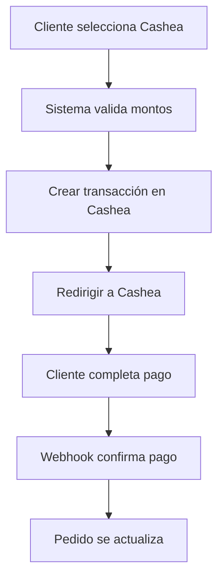

# Integración con Cashea - WooCommerce Venezuela Pro

## 🎯 **RESUMEN EJECUTIVO**

La integración con **Cashea** permite a los clientes venezolanos utilizar el servicio de "Compra ahora, paga después" directamente desde WooCommerce. Esta pasarela de pago está diseñada siguiendo las mejores prácticas de integración observadas en plataformas similares como Cujiware.

---

## 🔧 **CONFIGURACIÓN DE LA PASARELA**

### **1. Configuraciones Básicas**

| Campo | Descripción | Valor por Defecto |
|-------|-------------|-------------------|
| **Activar/Desactivar** | Habilitar la pasarela | No |
| **Título** | Nombre mostrado al cliente | "Paga con Cashea" |
| **Descripción** | Descripción del método de pago | "Compra ahora, paga después con Cashea..." |

### **2. Configuraciones de Entorno**

| Campo | Descripción | Opciones |
|-------|-------------|----------|
| **Modo de Operación** | Entorno de trabajo | Sandbox / Producción |
| **API Key de Producción** | Clave para entorno real | (Obligatorio para producción) |
| **API Key de Sandbox** | Clave para pruebas | (Obligatorio para sandbox) |

### **3. Configuraciones de Montos**

| Campo | Descripción | Formato |
|-------|-------------|---------|
| **Monto Mínimo** | Valor mínimo para activar la pasarela | USD (ej: 50.00) |
| **Monto Máximo** | Valor máximo permitido | USD (ej: 5000.00) |

### **4. Configuraciones Avanzadas**

| Campo | Descripción | Opciones |
|-------|-------------|----------|
| **Estado del Pedido Después del Pago** | Estado al completar pago | Estados de WooCommerce |
| **Modo Debug** | Activar logs detallados | Sí / No |
| **URL del Webhook** | URL para notificaciones | (Generada automáticamente) |

---

## 🔄 **FLUJO DE PAGO**

### **1. Proceso del Cliente**



### **2. Estados de Pago**

| Estado Cashea | Acción WooCommerce | Descripción |
|---------------|-------------------|-------------|
| `approved` | `payment_complete()` | Pago aprobado |
| `completed` | `payment_complete()` | Pago completado |
| `paid` | `payment_complete()` | Pago procesado |
| `rejected` | `update_status('failed')` | Pago rechazado |
| `failed` | `update_status('failed')` | Pago fallido |
| `declined` | `update_status('failed')` | Pago declinado |
| `pending` | `update_status('pending')` | Pago pendiente |
| `processing` | `update_status('pending')` | Pago en proceso |
| `cancelled` | `update_status('cancelled')` | Pago cancelado |

---

## 🛡️ **SEGURIDAD Y VALIDACIÓN**

### **1. Validación de Webhook**

```php
// Verificación de firma HMAC SHA256
$expected_signature = hash_hmac('sha256', $raw_body, $api_key);
$is_valid = hash_equals($expected_signature, $received_signature);
```

### **2. Validación de Montos**

```php
// Verificar montos mínimos y máximos
if ($cart_total < $min_amount || $cart_total > $max_amount) {
    return false; // Pasarela no disponible
}
```

### **3. Validación de Transacciones**

```php
// Verificar que la transacción corresponde al pedido
$stored_transaction_id = $order->get_meta('_cashea_transaction_id');
if ($stored_transaction_id !== $received_transaction_id) {
    return; // Transacción no válida
}
```

---

## 📊 **DATOS ENVIADOS A CASHEA**

### **1. Estructura de la Orden**

```json
{
  "amount": 150.00,
  "currency": "USD",
  "external_id": "12345",
  "customer": {
    "name": "Juan Pérez",
    "email": "juan@email.com",
    "phone": "+584121234567",
    "document": "V-12345678"
  },
  "billing_address": {
    "address_1": "Av. Principal 123",
    "city": "Caracas",
    "state": "DC",
    "postcode": "1010",
    "country": "VE"
  },
  "shipping_address": { ... },
  "items": [
    {
      "name": "Producto 1",
      "quantity": 2,
      "unit_price": 50.00,
      "total_price": 100.00,
      "sku": "PROD001",
      "category": "Electrónicos"
    }
  ],
  "return_url": "https://tienda.com/checkout/order-received/12345/",
  "cancel_url": "https://tienda.com/checkout/",
  "webhook_url": "https://tienda.com/?wc-api=wvp_cashea_callback",
  "metadata": {
    "woocommerce_order_id": "12345",
    "environment": "production"
  }
}
```

### **2. Headers de la Petición**

```http
Content-Type: application/json
Authorization: Bearer sk_live_...
X-Environment: production
User-Agent: WooCommerce-Venezuela-Pro/1.0.0
```

---

## 🔍 **SISTEMA DE LOGS**

### **1. Activar Modo Debug**

1. **WooCommerce → Configuración → Pagos**
2. **Seleccionar "Paga con Cashea"**
3. **Activar "Modo Debug (Log)"**
4. **Guardar cambios**

### **2. Ubicación de Logs**

```
wp-content/uploads/wc-logs/cashea-YYYY-MM-DD.log
```

### **3. Tipos de Logs**

| Tipo | Descripción | Ejemplo |
|------|-------------|---------|
| **Request** | Peticiones a Cashea | `[Cashea] Enviando request a Cashea` |
| **Response** | Respuestas de Cashea | `[Cashea] Respuesta de Cashea` |
| **Webhook** | Notificaciones recibidas | `[Cashea] Webhook recibido` |
| **Error** | Errores de integración | `[Cashea] Error al crear transacción` |

---

## 🚀 **CONFIGURACIÓN PASO A PASO**

### **1. Obtener Credenciales de Cashea**

1. **Registrarse en Cashea**
2. **Acceder al panel de administración**
3. **Generar API Keys:**
   - **Sandbox:** Para pruebas
   - **Producción:** Para uso real

### **2. Configurar en WooCommerce**

1. **WooCommerce → Configuración → Pagos**
2. **Activar "Paga con Cashea"**
3. **Configurar campos:**
   - **Modo:** Sandbox (para pruebas)
   - **API Keys:** Pegar las credenciales
   - **Montos:** Establecer límites
   - **Estado:** Seleccionar estado post-pago

### **3. Configurar Webhook en Cashea**

1. **Panel de Cashea → Webhooks**
2. **Añadir nueva URL:**
   ```
   https://tusitioweb.com/?wc-api=wvp_cashea_callback
   ```
3. **Seleccionar eventos:**
   - `payment.approved`
   - `payment.rejected`
   - `payment.pending`
   - `payment.cancelled`

### **4. Probar la Integración**

1. **Crear pedido de prueba**
2. **Seleccionar "Paga con Cashea"**
3. **Verificar redirección**
4. **Completar pago en Cashea**
5. **Verificar actualización del pedido**

---

## 🛠️ **SOLUCIÓN DE PROBLEMAS**

### **1. Pasarela No Aparece**

**Causas:**
- Monto fuera de rango configurado
- API Key no configurada
- Pasarela desactivada

**Solución:**
```php
// Verificar configuración
$min_amount = $this->get_option('min_amount');
$max_amount = $this->get_option('max_amount');
$api_key = $this->get_option('api_key_' . $this->environment);
```

### **2. Error de Redirección**

**Causas:**
- URL de checkout no generada
- Error en API de Cashea
- Credenciales incorrectas

**Solución:**
1. **Verificar logs de debug**
2. **Comprobar API Keys**
3. **Verificar conectividad**

### **3. Webhook No Funciona**

**Causas:**
- URL incorrecta
- Firma inválida
- Servidor no accesible

**Solución:**
1. **Verificar URL del webhook**
2. **Comprobar firma HMAC**
3. **Revisar logs de acceso**

### **4. Pedido No Se Actualiza**

**Causas:**
- Webhook no recibido
- Transacción no coincide
- Error en procesamiento

**Solución:**
1. **Revisar logs de webhook**
2. **Verificar ID de transacción**
3. **Comprobar estado del pedido**

---

## 📈 **MÉTRICAS Y MONITOREO**

### **1. Métricas de Éxito**

| Métrica | Objetivo | Cálculo |
|---------|----------|---------|
| **Tasa de Aceptación** | > 85% | Pagos aprobados / Total intentos |
| **Tiempo de Respuesta** | < 3 segundos | Tiempo de redirección |
| **Tasa de Webhook** | > 99% | Webhooks exitosos / Total enviados |

### **2. Alertas Recomendadas**

- **Error de API:** > 5% de fallos
- **Webhook fallido:** > 1% de fallos
- **Tiempo de respuesta:** > 10 segundos

---

## 🔄 **ACTUALIZACIONES Y MANTENIMIENTO**

### **1. Actualizaciones de API**

- **Monitorear cambios** en documentación de Cashea
- **Probar en sandbox** antes de producción
- **Actualizar versiones** del plugin

### **2. Mantenimiento Regular**

- **Revisar logs** semanalmente
- **Verificar webhooks** mensualmente
- **Actualizar credenciales** según sea necesario

---

## 📞 **SOPORTE TÉCNICO**

### **1. Información para Soporte**

- **Versión del plugin:** WooCommerce Venezuela Pro v1.0.0
- **Versión de WooCommerce:** 5.0+
- **Versión de PHP:** 7.4+
- **Logs de debug:** Últimos 7 días

### **2. Contacto**

- **Desarrollador:** WooCommerce Venezuela Pro
- **Documentación:** Cashea API Docs
- **Soporte Cashea:** Panel de administración

---

*Integración desarrollada siguiendo las mejores prácticas de seguridad y usabilidad para el mercado venezolano.*
